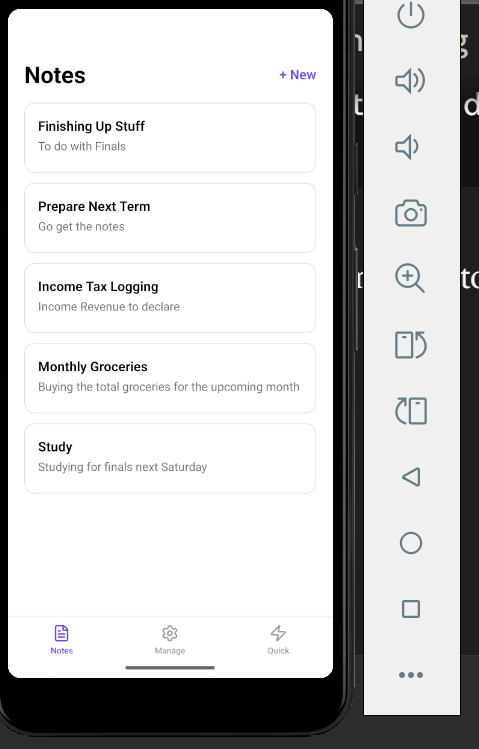
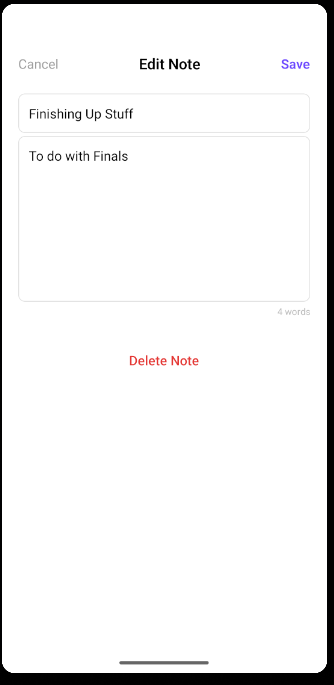
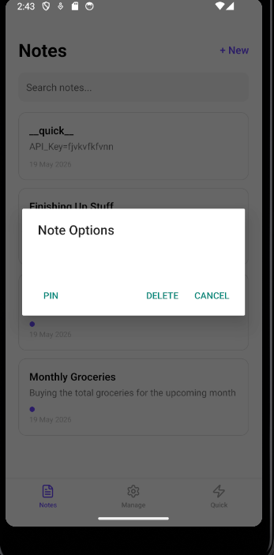
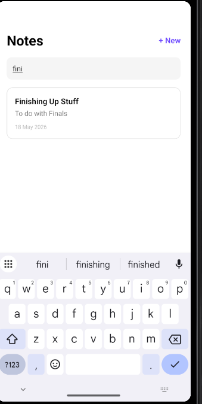
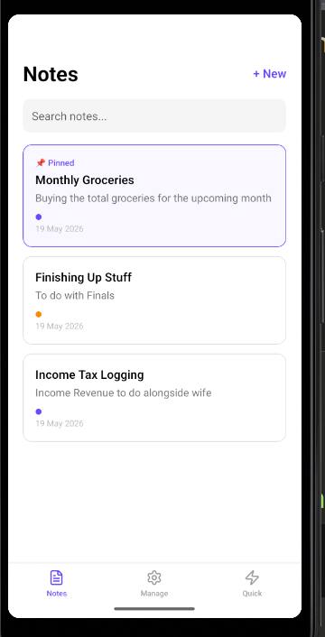
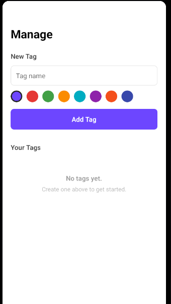
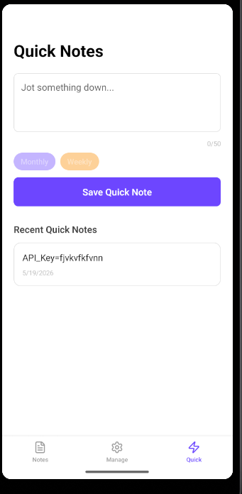

# NoteFlow

Una aplicación "light-weight", unicamente concentrada en la toma de notas cotidianas puntuales, desarrollada empleando   React Native y  Expo. Desde un comienzo esta conecbida para ser pequeña, minima y  persistente para el usuario — las notas almacenadas persistenlas notas almacenadas persisten en la nube via una API REST respaldada por una base de datos PostgreSQL.

---

## Tech Stack

| Herramienta | Proposito |
|---|---|
| Expo SDK + Expo Router | Navegación y bases del proyecto |
| React Native | UI y componentes clave de la App |
| Gluestack UI v3 | Librería de componentes visuales y "themes" |
| Zustand | Gesiton del estado global de las variables |
| Firebase | Autenticación de usuarios |
| Zod | Validación de los Formularios |
| Expo Haptics | Interacciones táctiles  |
| FlashList | Renderizado de la las notas  |
| TypeScript | Lenguaje de Programcion con checkeado de seguridad |
| Expo Image Picker | Selección de imágenes del dispositivo |

---

##  Los Features

### Autenticación

- Registro e inicio de sesión vía e-mail y contraseña.
- Cada cuenta tiene sus propias notas y tags - no se comparten entre cuentas , como es el comportamiento esperable.
- Cierre de Sesión desde la pestaña Manage
- Autenticación gestionada a través de Firebase Auth : Cada usuario tiene un UID unico provisto por Firebase que permite el filtrado de datos en la base de datos Neon.


### Notes

- Crear , borrar y deitar notas, tanot en el titulo como en el cuerpo.
- Busqueda con filtrado de la nota.
- Contador de caracteres.
- "Timestamp" para verificar la fecha de ultima edicion de la nota.
- Hacer "pin" a la nota que lo requiera para que merpanzeca en lo mas visible de la interfaz
- "Long press" de una nota almcaenada con el fin de editar o borrarla.
- Adjuntar una imagen a cualquier nota — la imagen se almacena en AWS S3 especificamente configurado por medio de permisos y acceso publico  y se muestra como un "thumbnail" en la lista de notas.












### Tags
- Crear un "tag" con un nombre y el color que se desee segun el tipo de nota.
- Añadido de "tags" a notas al momento de la edicion.
- Gestion y borrado de los"tags" desde la ventana de Manage.
- Los tags son exclusivos de cada cuenta de usuario.



### Quick Notes
- Toma de notas rapida sin necesidad de añadir titulo.
- Limite de caracteres de 45 para favorecer la brevedad.
- Aviso conform aproximación al limite de caracteres.
- Posibilidad de añadir "tags".
- Gestion separado de estas para su correcta orgnaización.



### Persistencia de los datos 

- Todas las notas y los tags se almacenan en la nube via la API de NoteFlow (desplegada en Vercel)
- La base de datos es PostgreSQL alojada en Neon
- Los datos persisten entre sesiones y dispositivos
- Las imágenes adjuntas a las notas se almacenan en AWS S3

---

## Servicios Externos

### Firebase Auth

Firebase se utiliza exclusivamente para la autenticación de usuarios. Al registrarse o iniciar sesión, Firebase genera un UID único por usuario. Este UID se adjunta a cada nota y tag en la base de datos, garantizando que cada cuenta solo acceda a sus propios datos. Firebase no almacena notas ni tags — solo gestiona la identidad del usuario y por el momento no se prevee añadir algún otro feature provisot por firebase.

### AWS S3 

- Amazon S3 se utiliza para el almacenamiento de imágenes. Cuando un usuario adjunta una imagen a una nota, la imagen se sube al bucket `noteflow-images` en S3 bajo una carpeta con el UID del usuario. La URL resultante se guarda en la base de datos(neon no sporta el almacenaje como tal de imagenes) junto a la nota y se usa para mostrar la imagen en la app.

## Variables de Entorno

Se debe crear un archivo .env en la raíz del proyecto con :

JAVA_HOME=C:\Program Files\Android\Android Studio\jbr
EXPO_PUBLIC_AWS_ACCESS_KEY_ID=your_aws_access_key
EXPO_PUBLIC_AWS_SECRET_ACCESS_KEY=your_aws_secret_key
EXPO_PUBLIC_AWS_BUCKET_NAME=noteflow-images
EXPO_PUBLIC_AWS_REGION=eu-central-1

Así mismo el archivo `google-services.json` de Firebase debe colocarse en la raíz del proyecto, no en la subcarpeta Android, como predeterminadamente sugiere Firebase al general el "config file".

## Prerequisitos

Es necesario tener instalado localmente :

- Node.js v18+
- Android Studio con el  Android Emulator (Pixel 3a API 34 usado durante el desarrollo)
- Java 17 (Android Studio's  JDK agrupado  es seleccionado automaticamente `android/local.properties`)

---

## Setup

```bash
# Clonar el Repo
git clone https://github.com/JCCLN19952008/NoteFlow.git
cd NoteFlow

# Instalar las dependencias
npm install

# Añadir local.properties para el  Android SDK y los  Java paths
# Crear android/local.properties con:

# sdk.dir=C:\\Users\\YOUR_USERNAME\\AppData\\Local\\Android\\Sdk
# org.gradle.java.home=C:\\Program Files\\Android\\Android Studio\\jbr
```

---

## Funcionamiento de la App

Asegurarse que previamente el Android Emulator ha sido arrancado, entonces:

```bash
# Hacer el build y instalar en el emulador ya arrancado (tanto la primera vez como cada vez qeu se hace algun cambio a la configuracion nativa de la app derivada de las librerias)
npx expo run:android

# Subsiguiente sesiones de desarrollo 
npx expo start --dev-client
```

Si el emulador no lograra conectar con el Servidor Metro, corre este comando en forma de tunel en otra terminal secundaria:

```bash
"C:\Users\YOUR_USERNAME\AppData\Local\Android\Sdk\platform-tools\adb.exe" reverse tcp:8081 tcp:8081
```

Enctonces abrir NoteFlow en el emulador y conectar a  `http://10.0.2.2:8081`( a veces conecta automaticamente sin typear la IP)

---

## Estructura de Directorios

```
NoteFlow/
├── app/
│   ├── _layout.tsx           # Root layout with GestureHandlerRootView and GluestackUIProvider, bootstraps auth and fethces data for login
|   ├── auth.tsx              # Login and signup screen
│   ├── (tabs)/
│   │   ├── _layout.tsx       # Tab bar with Notes, Manage, Quick tabs
│   │   ├── index.tsx         # Notes list with search and FlashList
│   │   ├── manage.tsx        # Tag creation, management and logout
│   │   └── quick.tsx         # Quick note capture
│   └── note/
│       ├── new.tsx           # New note form with Zod validation
│       └── [id].tsx          # Note detail and edit screen
├── services/
│   ├── api.ts                # All HTTP calls to the NoteFlow API
│   └── s3.ts                 # Image upload to AWS S3 via API
├── store/
│   ├── notesStore.ts         # Zustand store for notes 
│   └── tagsStore.ts          # Zustand store for tags with 
└── schemas/
    └── noteSchema.ts         # Zod validation schema for note form
```

---

## Notas para el Evaluador

- La aplicación usa un  **Development Build** en lugar  de Expo Go debido a dependencias nativas(FlashList, Gesture Handler parcialmente).
- `android/` se excluye del repo publico via  `.gitignore` — se regenera cada vez que se ejecuta `npx expo run:android`.
- `android/local.properties` tiene que ser creado manualmente con los "paths" acordes a la configuracion de tu maquina local
- `google-services.json` debe descargarse desde la consola de Firebase y colocarse en la raíz del proyecto.
- El archivo `.env` debe crearse manualmente con las credenciales de AWS — nunca se sube al repositorio.
- La API backend está desplegada en Vercel: `https://noteflow-api-ten.vercel.app`
- La variable de entorno  `JAVA_HOME` para Gradle se configura via  `.vscode/settings.json` para apuntar al Android Studio's  JDK agrupado, de manera que se evitan conflictos con otras versiones de JAVA instaladas en la maquina local.